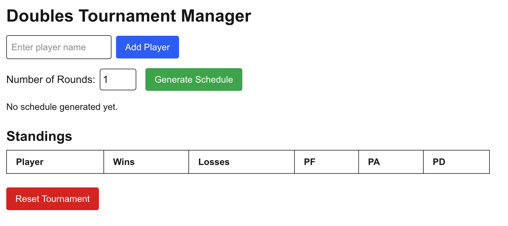

# 🏆 Doubles Tournament Manager

An interactive web app to manage balanced doubles tournaments. Automatically generates schedules, handles scoring, tracks standings, and creates playoff brackets based on performance.



## 🚀 Live Demo

[//]: # (👉 [Try it live]&#40;https://your-app-url.vercel.app&#41;  )

[//]: # (👉 [Watch demo video]&#40;https://link-to-video.com&#41;)

* To be added *

## 🧩 Features

- ✅ Add and remove players
- ✅ Generate balanced doubles schedules
- ✅ Input match scores
- ✅ Automatically update standings (wins, losses, PF, PA, PD)
- ✅ Auto-generate playoff brackets
- ✅ Sort standings with tie-breakers (point differential, points scored)

## 🛠️ Tech Stack

- **Frontend:** React (Next.js), TypeScript, Tailwind CSS
- **State Management:** React hooks (`useState`, `useEffect`)
- **Logic:** Custom algorithms for scheduling, scoring, and playoffs

## 📦 Installation

```bash
# Clone the repo
git clone https://github.com/yourusername/doubles-tournament-manager.git
cd doubles-tournament-manager

# Install dependencies
npm install

# Run the dev server
npm run dev
